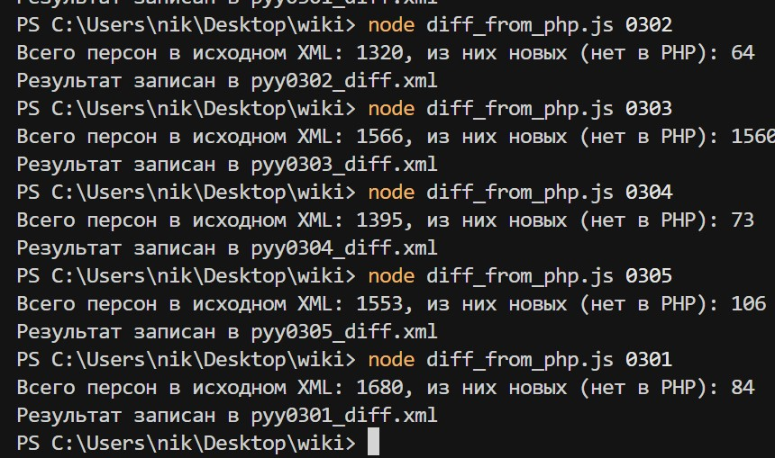

Набор скриптов на Node.js для парсинга русской Википедии.  
Скрипты берут категории вида `Категория:Родившиеся_<день>_<месяца>` и сохраняют:

- **XML** в формате, удобном для дальнейшей обработки (`parser_xml.js`).
- **JSON** с той же информацией и дополнительными полями (`parser_json.js`).

## Разница с исходниками Льва. 


## Установка

Node.js v18+

```bash
npm install
```

## Формат аргумента даты

Оба скрипта принимают один аргумент **в формате `MMDD` (месяц + день)**.  
Примеры:

- `0301` → 1 марта (`day="03-01"`)
- `0626` → 26 июня (`day="06-26"`)

## Использование: XML (`parser_xml.js`)

Команда:

```bash
node parser_xml.js 0301
```

Результат:

- будет создан файл `persons_03-01.xml`;
- структура:

```xml
<?xml version='1.0' encoding='utf-8'?>
<persons day="03-01" comm="Личности, родившиеся 01 марта">
  <psn y="1958" h="Абал, Самуэль" p="Государственный деятель; " yd="alive" />
  ...
</persons>
```

Поля:

- **`y`** — год рождения;
- **`h`** — имя/название статьи;
- **`p`** — род деятельности (строка из инфобокса);
- **`yd`** — год смерти или `"alive"`, если дата смерти не найдена.

## Использование: JSON (`parser_json.js`)

Команда:

```bash
node parser_json.js 0301
```

Результат:

- будет создан файл `result_03-01.json` со структурой:

```json
{
  "day": "03-01",
  "comment": "Личности, родившиеся 01 марта",
  "persons": [
    {
      "name": "Абал, Самуэль",
      "url": "https://ru.wikipedia.org/wiki/Абал,_Самуэль",
      "bdYear": "1958",
      "deathYear": null,
      "occupation": "Государственный деятель; ..."
    }
  ]
}
```

